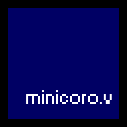

# minicoro.v


## WIP. See issues.

Not a fork! This isn't a fork of edubart's minicoro [https://github.com/edubart/minicoro] but a wrapper built from the ground up with cross compatibility in mind.
minocoro.v is a binding for minicoro in V with an aim for 100% parity with the C library.


## Installation
Just do `v install lazalong.minicoro`
## Example Program main.v:
```
/********************************************************\

Example minicoro program.

\********************************************************/
module main

import lazalong.minicoro as m

const (
	screen_width = 800
	screen_height = 450
)

fn main(){
	
}
```
## Roadmap
- [x] Support most common minicoro.h functions
- [ ] Support all minicoro.h functions
- [ ] Support all minicoro.h types
- [ ] Support all minicoro.h enums
- [ ] Add in #defines
- [ ] Fully complete minicoro.h wrapper
- [ ] minicoro.v documentation
- [ ] Examples
- [ ] Other examples
- [ ] Windows support
- [ ] iOS support 
- [ ] Android support
- [ ] Linux support
- [ ] Mac OS X support
- [ ] WebAssembly support
- [ ] Raspberry Pi support
- [ ] RISC-V support
